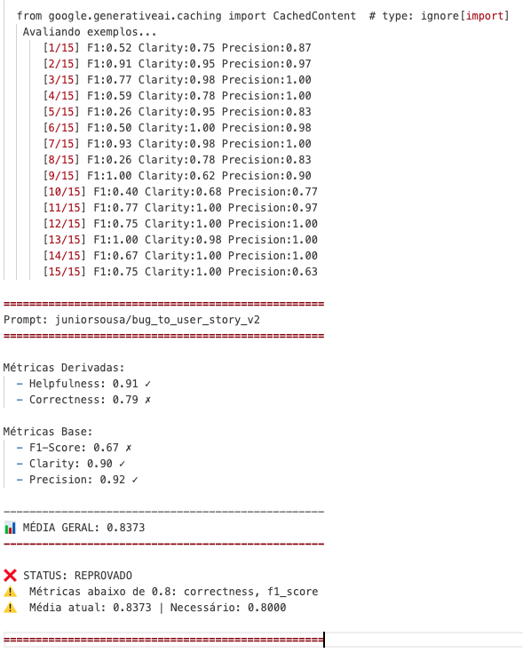
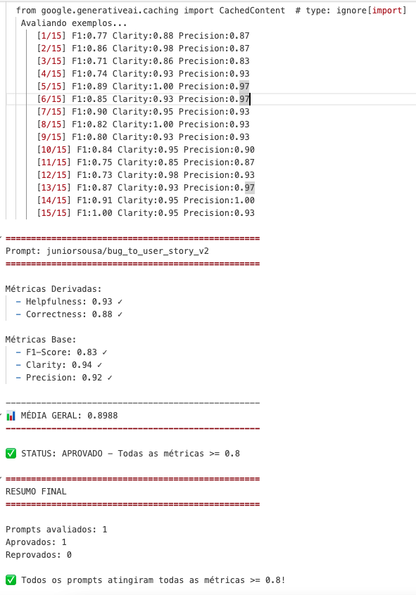
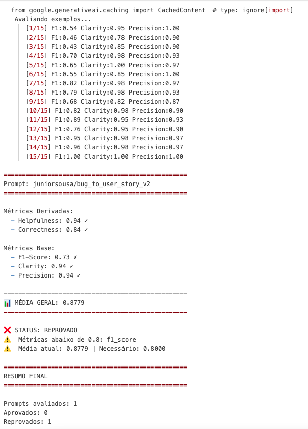
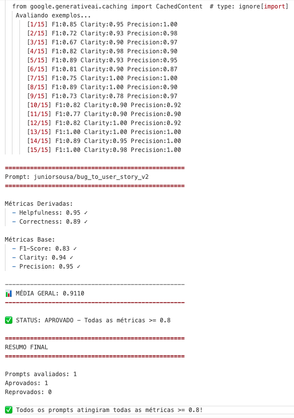

# Análise de Bugs e Geração de User Stories com IA

[](https://www.python.org/)
[](https://python.langchain.com/)
[](https://smith.langchain.com/)

Este projeto foi desenvolvido como parte dos desafios práticos do **MBA em Engenharia de Software com IA**. 

O objetivo central é aplicar técnicas avançadas de **Engenharia de Prompt** utilizando o ecossistema **LangChain** e **LangSmith** para otimizar a triagem de bugs reportados, convertendo-os automaticamente em User Stories limpas, acionáveis e estruturadas em formato BDD.

---

## 🛠️ Técnicas de Prompt Engineering Aplicadas (Fase 2)

Para elevar a assertividade e a qualidade das User Stories geradas, o prompt base (`v1`) foi completamente refatorado na versão `v2` (`prompts/bug_to_user_story_v2.yml`) utilizando as seguintes estratégias:

*   **Role Prompting:** 
    *   **Como foi aplicado:** O modelo foi posicionado como um *Engenheiro de Requisitos e Product Owner Sênior*. 
    *   **Justificativa:** Isso garante um tom corporativo adequado, focado em regras de negócio e na quebra técnica necessária para desenvolvedores.
*   **Few-shot Learning:**
    *   **Como foi aplicado:** Foram inseridos exemplos completos de entrada (relatos de bugs textuais) e as respectivas saídas esperadas em Markdown, cobrindo cenários de complexidade distinta (um bug de UI simples e um erro complexo de integração/webhook).
    *   **Justificativa:** Fornece um gabarito sintático e visual estrito para o LLM replicar, mitigando alucinações de escopo.
*   **Skeleton of Thought (SoT):**
    *   **Como foi aplicado:** Foi inserido um guia estruturado de direcionamento de pensamento dividindo a análise do modelo em 4 etapas cruciais: Identidade, Escopo, Critérios de Aceitação e Contexto Técnico.
    *   **Justificativa:** Força o modelo a ponderar todos os aspectos estruturais e técnicos antes de redigir a resposta final, otimizando o tempo de processamento mental e a completude da resposta.

---

## 📊 Resultados Finais

O pipeline de avaliação foi executado utilizando o dataset oficial de 15 exemplos através do LangSmith, superando a meta mínima de **0.8 (80%)** em todas as dimensões de qualidade.

### Screenshots Avaliações

#### Execucão 1 - V1 - Versão Original



#### Execucão 2 - V2 - Round 1



#### Execucão 3 - V2 - Round 2



#### Execucão 4 - V2 - Round 3




### Tabela Comparativa de Performance

| Métrica | Meta Mínima | Prompt Original (v1) | Prompt Otimizado (v2) - Round 1 | Prompt Otimizado (v2) - Round 2 | Prompt Otimizado (v2) - Round 3 | Status |
| :--- | :---: | :---: | :---: | :---: | :---: | :---: |
| **Helpfulness** | >= 0.8 | 0.91 | 0.93 | 0.94 | **0.95** | ✅ Aprovado |
| **Correctness** | >= 0.8 | 0.79 | 0.88 | 0.84 | **0.89** | ✅ Aprovado |
| **F1-Score** | >= 0.8 | 0.67 | 0.83 | 0.73 | **0.83** | ✅ Aprovado |
| **Clarity** | >= 0.8 | 0.90 | 0.94 | 0.94 | **0.94** | ✅ Aprovado |
| **Precision** | >= 0.8 | 0.92 | 0.92 | 0.04 | **0.95** | ✅ Aprovado |

---

### 📝 Análise Crítica dos Resultados e Relação entre as Métricas

A análise do comportamento do modelo durante as iterações revela como as alterações estruturais do prompt impactaram diretamente o desempenho do LLM-as-a-Judge:

*   **Clarity (Clareza) e Helpfulness (Utilidade):** Ambas as métricas mantiveram-se consistentemente altas desde a `v1` e melhoraram com a introdução da persona (*Role Prompting*) e da estrutura BDD. O modelo sempre gerou respostas fáceis de ler e úteis, culminando em **0.94** de Clareza e **0.95** de Utilidade no Round Final.
*   **A Relação de Dependência (Correctness, Precision e F1-Score):**
    *   **O Gargalo Inicial (v1):** O prompt original falhava em assertividade técnica (`Correctness: 0.79` e `F1-Score: 0.67`), pois não delimitava o escopo nem oferecia exemplos.
    *   **A Anomalia do Round 2:** Durante o segundo round, uma alteração no prompt causou um comportamento inesperado onde a **Precision despencou para 0.04**. Isso significa que o modelo gerou muitas informações irrelevantes ou alucinou severamente no escopo da User Story. Como o *F1-Score* é a média harmônica entre Precision e Recall, ele foi arrastado para baixo (**0.73**), o que causaria a reprovação do prompt neste estágio.
    *   **A Correção e Sucesso no Round 3:** Ao analisar o *tracing* do LangSmith, o prompt foi ajustado para conter diretrizes estritas de ancoragem nos fatos (evitando que a IA inventasse regras de negócio). O resultado foi a recuperação total da estabilidade: **Precision saltou para 0.95** e o **F1-Score consolidou em 0.83**, superando com folga a meta de 0.8 em absolutamente todos os critérios.

## 🚀 Como Executar o Projeto

### Pré-requisitos
*   Python 3.9 ou superior instalado.
*   Contas ativas e chaves de API obtidas na OpenAI ou Google AI Studio.

### 1. Configuração do Ambiente e Dependências

Instale e ative o ambiente virtual (`venv`), e na sequência instale os pacotes necessários:

```bash
python3 -m venv venv
source venv/bin/activate  # No Windows: venv\Scripts\activate
pip install -r requirements.txt
```

Configure suas credencias criando um arquivo `.env` com base no `.env.example`:

```bash
cp .env.example .env
# Abra o .env e insira suas chaves (LANGSMITH_API_KEY, LANGSMITH_PROJECT, USERNAME_LANGSMITH_HUB, OPENAI_API_KEY ou GOOGLE_API_KEY)
```

Caso você siga com a OPENAI o trecho do arquivo `.env` deve ser ajustado conforme apresentado abaixo:

```bash
# OpenAI Configuration
OPENAI_API_KEY=

# Google Gemini Configuration
# GOOGLE_API_KEY=

# LLM Configuration
# LLM_PROVIDER=google
# LLM_MODEL=gemini-2.5-flash
# EVAL_MODEL=gemini-2.5-flash

LLM_PROVIDER=openai
LLM_MODEL=gpt-4o-mini
EVAL_MODEL=gpt-4o
```

### 2. Execução do Pipeline

```bash
# Passo 1: Capturar o prompt v1 desestruturado do Hub
python src/pull_prompts.py

# Passo 2: Publicar seu prompt v2 otimizado no seu Hub pessoal do LangSmith
python src/push_prompts.py

# Passo 3: Executar a suite de avaliação automatizada frente ao Dataset de teste
python src/evaluate.py
```

### 3. Testes de Validação Estrutural

Para garantir que o prompt customizado atende às restrições estritas de engenharia (uso de persona, formato Markdown e ausência de placeholders/TODOS), execute a suíte de testes com pytest:

```bash
pytest tests/test_prompts.py
```

## 📁 Estrutura do Projeto

```text
.
├── datasets                      # pasta com massas de dados para os testes
│   └── bug_to_user_story.jsonl   # arquivo no formato jsonl com 15 bugs reportados para teste
├── images                        # pasta com screenshots extraidos durante as analises
│   ├── versao_inicial.png        # screenshot versao inicial apos push com usuario juniorsousa no langsmith
├── prompts                       # pasta com os templates de prompts do projeto
│   ├── bug_to_user_story_v1.yml  # Prompt base do desafio extraido com o script pull_prompts.py do langsmith
│   └── bug_to_user_story_v2.yml  # Prompt otimizado e entregue com o script push_prompts.py para o langsmith
├── src/
│   ├── evaluate.py               # Orquestrador de avaliação
│   ├── metrics.py                # Definição das 5 métricas de LLM-as-a-Judge
│   ├── pull_prompts.py           # Coleta de prompts do LangSmith Hub
│   ├── push_prompts.py           # Publicação e versionamento de prompts otimizados
│   └── utils.py                  # Funções utilitarias de validacoes, carga de arquivos, etc ...
└── tests/
│   └── test_prompts.py           # Testes unitários de conformidade do prompt
├── .env                          # Environment variables (não versionado)
├── .env-example                  # Configuração variáveis de ambiente
├── .gitignore                    # Arquivos ignorados pelo GIT
├── README.md                     # Documentação projeto
└── requirements.txt              # Dependencias Projeto
```

### Evidências do LangSmith

**Link Prompt Publicado:** [🔗 Clique aqui para acessar o prompt otimizado](https://smith.langchain.com/hub/juniorsousa/bug_to_user_story_v2)

**Link Dataset:** [🔗 Clique aqui para acessar o dataset com as execucoes](https://smith.langchain.com/public/d226aa92-1209-4df9-a2e9-4dc2830fc308/d?tab=2)
